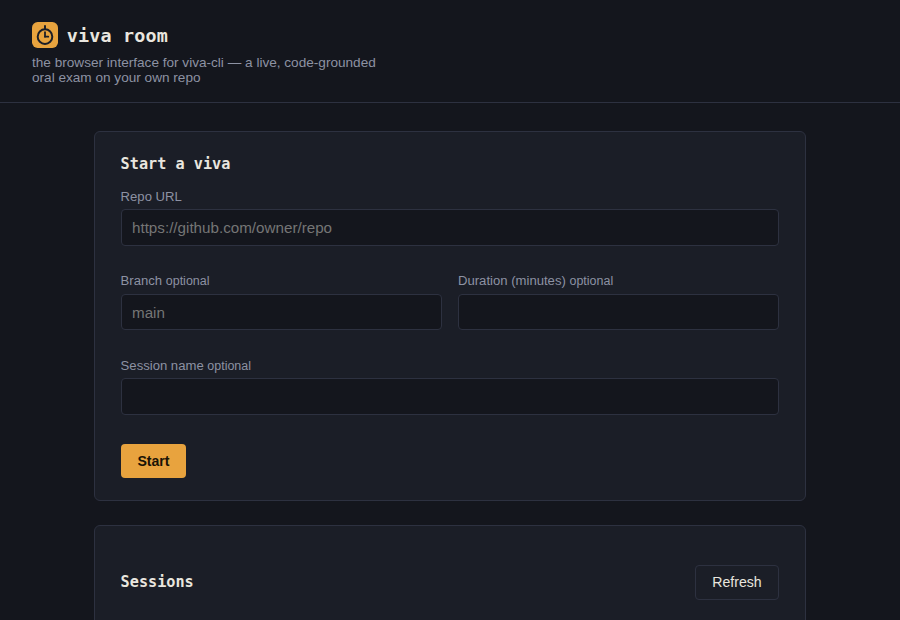
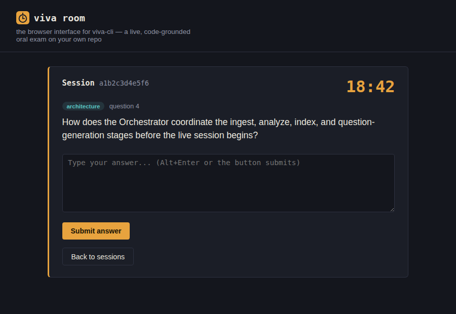
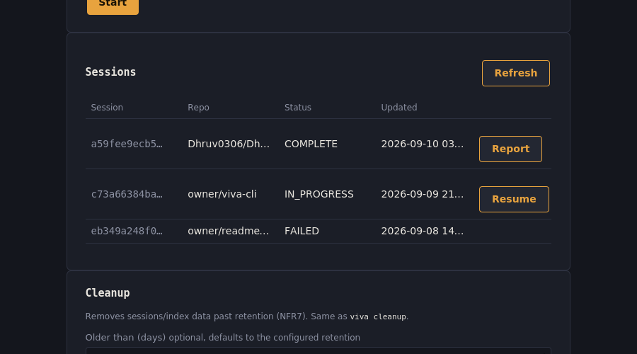
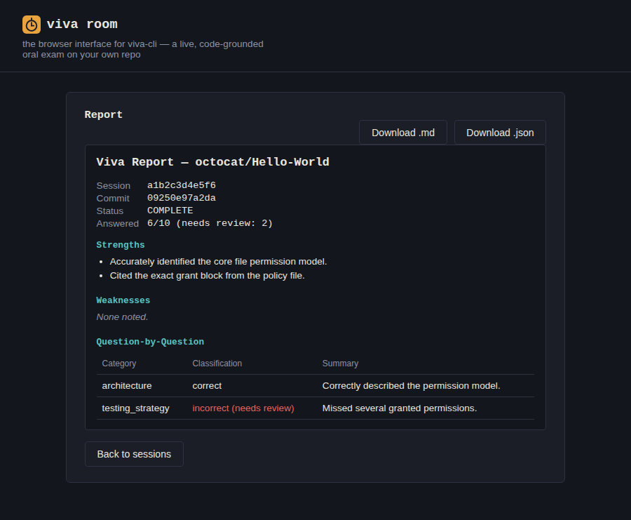

# viva-cli

[](https://github.com/Dhruv0306/viva-cli/actions/workflows/tests.yml)
[](https://github.com/Dhruv0306/viva-cli/releases/latest)

**A local-LLM RAG tool that analyzes a GitHub project and conducts a timed, code-grounded viva (oral exam) on it — then reports what you knew, what you missed, and how to improve.**

Point it at a repo, and it clones the project, builds a real understanding of its architecture via retrieval-augmented analysis, then runs a configurable timed Q&A session grounded entirely in your actual code — not generic interview questions. Every question is traceable to a real file/function, and every evaluation is judged against that same code, not against the model's general opinions.

Runs entirely on a local LLM (via [Ollama](https://ollama.com)) — no API keys, no cost, no code ever leaves your machine.

## Why

Explaining your own project out loud — to an interviewer, a thesis committee, a code reviewer — is a different skill from having built it. This tool is a practice partner for that: it knows your codebase because it actually read it, asks about the parts that matter (architecture, design decisions, edge cases, testing), and tells you specifically what to go back and re-learn.

## Features

- 🔗 **Just a GitHub URL** — clone, filter, and analyze up to 500 files per repo, with representative sampling across modules for larger projects
- 🧠 **Grounded RAG pipeline** — AST-based code chunking (tree-sitter), local embeddings, project-level architecture summary via map-reduce analysis
- ⏱️ **Timed viva** — configurable duration (default 30 min), shown as a live countdown; the clock only counts your answering time, never LLM thinking time
- 🔁 **Adaptive follow-ups** — weak answers get probed further, bounded by configurable depth
- ✅ **Grounded evaluation** — every "you missed this" or "this was wrong" verdict cites the specific file/function it's based on; ungrounded criticism is discarded, not shown
- 📄 **Structured per-question feedback** — summary, what you did well, what you missed, what you got wrong, and how to improve, for every question
- 💻 **Zero cost** — entirely local inference via Ollama, no external API calls required
- 💾 **Crash-resumable** — session state is persisted continuously; an interrupted viva can be resumed
- 🎤 **Voice mode** — speak your answers and have questions read aloud, entirely local (faster-whisper + Piper), in both the CLI and viva room, with automatic fallback to typed input

## How it works

```
GitHub URL → Ingest & sample (≤500 files) → Analyze (Project Profile)
           → Index (RAG) → Plan question coverage
           → Timed viva (adaptive Q&A, grounded in your code)
           → Evaluate each answer against the code
           → Summary report
```

See [`docs/design.md`](docs/design.md) for the full architecture, and [`docs/system-design/`](docs/system-design/) for the detailed design rationale and iteration history behind it.

## Requirements

- Python 3.11+
- [Ollama](https://ollama.com) installed and running locally
- `git`

## Installation

```bash
git clone https://github.com/<your-username>/viva-cli.git
cd viva-cli
pip install -r requirements.txt
cp .env.example .env
```

Pull the models used by default:

```bash
ollama pull gemma4:e4b
ollama pull nomic-embed-text
```

## Configuration

All tunables live in `.env`:

```ini
VIVA_DURATION_MINUTES=30
LLM_MODEL=gemma4:e4b
EMBEDDING_MODEL=nomic-embed-text
VECTOR_DB_PATH=./data/chroma
# MAX_QUESTIONS=8   # commented out by default -- see note below
TOP_K_RETRIEVAL=5
MAX_RETRIEVAL_DISTANCE=0.85
MAX_FILES=500
TEST_FILE_QUOTA_PCT=10
MAX_FOLLOWUP_DEPTH=1
SESSION_RETENTION_DAYS=7
MAP_REDUCE_BATCH_SIZE=8
GITHUB_TOKEN=
TEMPERATURE=0.3
LINE_WINDOW_SIZE=60
LINE_WINDOW_OVERLAP=15
SESSION_DB_PATH=./data/viva.db
AVG_TIME_PER_CATEGORY_SECONDS=180
QUESTION_SIMILARITY_THRESHOLD=0.90
EVAL_FLUSH_TIMEOUT_SECONDS=60
VOICE_ENABLED=false
STT_MODEL_SIZE=small
TTS_VOICE=en_US-lessac-medium
VOICE_CACHE_DIR=./data/voice_models
VOICE_MAX_ANSWER_SECONDS=120
VOICE_SILENCE_TIMEOUT_SECONDS=2.5
```

`MAX_QUESTIONS` is unset by default: when it's not set, the question
budget is derived from the session's own duration (roughly one question
per two minutes) instead of a flat count, so a short session naturally
plans fewer questions than a long one. Uncomment `MAX_QUESTIONS` and set
a number to pin the budget regardless of what duration any individual
session picks.

`MAX_RETRIEVAL_DISTANCE` defaults to `0.85` as of Phase 16 -- a
retrieved chunk whose L2 distance from the query exceeds this is
dropped, so a plan item left with nothing well-grounded to ask about
gets skipped instead of turning into a weak, generic question. `0.85`
is a real default, informed by real session logging across three repos
and five question categories, not a guess -- see
`docs/system-design/22-phase-16-grading-integrity-observability-
design.md` §22.2.2 for the underlying data. A `Retrieval for
category=... (distances: min=... max=...)` line prints at INFO
alongside every question generated; if your own sessions' numbers
suggest a different value fits your repos better, override it.

## Usage

```bash
viva start https://github.com/<owner>/<repo> [--branch main] [--duration 30] [--session-name my-project]
```

List past/resumable sessions (session IDs aren't shown anywhere else after the initial run):

```bash
viva list [--status in_progress|complete|...]
```

Resume an interrupted session:

```bash
viva resume <session-id>
```

View a past report:

```bash
viva report <session-id> [--format md|json] [--output report.md] [--allow-partial]
```

Remove session/Q&A records, Project Profile JSON files, and Chroma
collections past retention (NFR7), or everything with `--all`:

```bash
viva cleanup [--older-than <days>] [--all]
```

Or run viva room instead of the CLI -- the local browser interface, over
the same Orchestrator/SessionStore underneath:

```bash
viva serve [--host 127.0.0.1] [--port 8000]
```

Open `http://127.0.0.1:8000` for a browser page that starts/resumes
sessions, answers questions live, and views reports -- the same
operations as `viva start`/`resume`/`list`/`report`/`cleanup` above, not
a different feature set (see
[`docs/system-design/15-phase-10-web-ui-design.md`](docs/system-design/15-phase-10-web-ui-design.md)).
The default `--host 127.0.0.1` needs nothing else; it's a local
single-user tool with the same trust boundary the CLI itself already
has.

Binding to any other address (`--host 0.0.0.0`, to reach it from another
device on your network) is different: `viva serve` prints an access
token at startup, and every `/api/*` request needs it from then on.
Open the printed link as-is (it already carries `?token=...`) and the
page picks the token up automatically for the rest of that browser tab
-- no further action needed. To reach it from a different browser or
device, either reuse that same link or add the token yourself, as a
query parameter (`?token=<token>`) or an `X-Viva-Token` header. A
request without it gets `401`. See
[`docs/system-design/21-phase-15-serve-authentication-design.md`](docs/system-design/21-phase-15-serve-authentication-design.md).

Speak your answers instead of typing, and have questions read aloud,
in either the CLI or viva room (see
[`docs/system-design/16-phase-11-voice-io-design.md`](docs/system-design/16-phase-11-voice-io-design.md)
and
[`docs/system-design/17-phase-12-web-voice-io-design.md`](docs/system-design/17-phase-12-web-voice-io-design.md)):

```bash
pip install -e ".[voice]"
viva voice setup [--stt-model small] [--tts-voice en_US-lessac-medium]
```

Then set `VOICE_ENABLED=true` in `.env` before `viva start`/`resume`/
`serve`. Falls back to typed input automatically if nothing's heard,
or if a model/microphone/speaker isn't available. In viva room, voice
is a per-browser-session toggle on the start form -- shown only once
`VOICE_ENABLED=true` and the browser itself supports it (a secure
context -- HTTPS or `localhost` -- with microphone access); each open
tab decides independently, nothing is stored server-side about which
sessions have it on.

<table>
<tr>
<td width="50%">

<br /><sub>Start a viva, with voice mode enabled, and the sessions ledger</sub>
</td>
<td width="50%">

<br /><sub>Live Q&amp;A -- a spoken answer, transcribed and ready to review before submitting</sub>
</td>
</tr>
<tr>
<td width="50%">

<br /><sub>Sessions in different states -- only a resumable session offers Resume</sub>
</td>
<td width="50%">

<br /><sub>The rendered report, with download buttons</sub>
</td>
</tr>
</table>

`viva start`/`resume`/`list`/`report`/`cleanup`/`serve` are all real as of Phase 10.

Full CLI contract, including exit codes: [`docs/system-design/06-cli-contract-and-profile-scaling.md`](docs/system-design/06-cli-contract-and-profile-scaling.md) §6.1.

Four Phase 2/3/4/5 smoke-test commands also exist for manually exercising ingestion, analysis, indexing, and question generation against a real repo ahead of `viva start`:

```bash
viva ingest https://github.com/<owner>/<repo> [--branch main]
viva analyze https://github.com/<owner>/<repo> [--branch main] [--output project_profile.json]
viva index https://github.com/<owner>/<repo> [--branch main] [--query "how is auth handled?"]
viva questiongen https://github.com/<owner>/<repo> [--branch main]
```

## Project status

Early build stage — see [`docs/plan.md`](docs/plan.md) for the phased build plan, starting from a Phase 0 walking skeleton through to polish. Not yet ready for general use.

Phases 0-17 are implemented, currently at **v0.3.0** (see [`CHANGELOG.md`](CHANGELOG.md)):

- **Phase 0 — walking skeleton.** `viva demo` (still runnable, see below) proved out the two riskiest assumptions before anything else got built: local-model structured-output reliability, and a timer that excludes LLM latency.
- **Phase 3 — analyze.** Tree-sitter AST extraction and map-reduce Project Profile generation, with a hierarchical-reduce fallback for repos with many modules. [`08-phase-3-analyzer-design.md`](docs/system-design/08-phase-3-analyzer-design.md)
- **Phase 4 — index.** Function/class-granularity chunking, local Ollama embedding, a Chroma vector store keyed per commit and reused for unchanged commits. [`09-phase-4-indexing-design.md`](docs/system-design/09-phase-4-indexing-design.md)
- **Phase 5 — question generation.** Category-based coverage plan, just-in-time grounded question generation, and a query-reformulation fix for a retrieval-quality issue found during Phase 4's real-repo testing. [`10-phase-5-questiongen-design.md`](docs/system-design/10-phase-5-questiongen-design.md)
- **Phase 6 — session loop.** The real `viva start`/`resume`/`list`: SQLite session persistence, the Orchestrator driving the full pipeline plus the live timed Q&A loop, and the time-budget collapse behavior from `docs/design.md` §7. [`11-phase-6-session-loop-design.md`](docs/system-design/11-phase-6-session-loop-design.md)
- **Phase 7 — evaluation.** Real, grounded, structured per-answer evaluation replacing the Phase 6 placeholder: a fast classification call plus a backgrounded free-text feedback call. [`12-phase-7-evaluator-design.md`](docs/system-design/12-phase-7-evaluator-design.md)
- **Phase 8 — reporting.** The real `viva report` command, aggregating a session's evaluations into strengths/weaknesses/topics-to-revisit. [`13-phase-8-report-design.md`](docs/system-design/13-phase-8-report-design.md)
- **Phase 9 — polish.** `viva cleanup`, enforcing NFR7 retention with reference-counted collection deletion so a collection shared by more than one session against the same commit is never removed while another still depends on it. Config validation and the `LLM_MODEL` pressure-test harness (`scripts/pressure_test_llm_model.py`) landed here too — see [`07-llm-model-pressure-test-results.md`](docs/system-design/07-llm-model-pressure-test-results.md) for results once run locally. [`14-phase-9-polish-design.md`](docs/system-design/14-phase-9-polish-design.md)
- **Phase 10 — web UI.** `viva serve` / viva room: a local FastAPI server exposing the same operations as the CLI plus the live Q&A loop, fronted by a single static HTML+JS page with no build step. `WebSessionUI` bridges the Orchestrator's blocking `read_answer()` call onto a background thread so it never blocks an HTTP request. [`15-phase-10-web-ui-design.md`](docs/system-design/15-phase-10-web-ui-design.md)
- **Phase 11/12 — voice I/O.** Local speech-to-text and text-to-speech (faster-whisper, Piper), in both the CLI and viva room, with automatic fallback to typed input whenever voice fails. [`16-...`](docs/system-design/16-phase-11-voice-io-design.md) / [`17-...`](docs/system-design/17-phase-12-web-voice-io-design.md)
- **Phase 13 — architecture-tier questions.** The `architecture` category split into an extensible set of topics (overview, pipeline, security, integration, concurrency), asked ahead of the other four categories instead of interleaved with them. The question budget now scales with a session's own duration instead of a flat default. [`18-phase-13-architecture-tier-questions-design.md`](docs/system-design/18-phase-13-architecture-tier-questions-design.md)
- **Phase 14 — security fixes.** Closed a `git clone` URL-scheme/host validation gap that could reach an unrestricted git transport or leak `GITHUB_TOKEN` to the wrong host, a stored XSS in the session list, and a `duration_minutes` validation bug — from the September 2026 panel review. [`19-panel-review-findings-2026-09.md`](docs/system-design/19-panel-review-findings-2026-09.md) / [`20-phase-14-security-hardening-design.md`](docs/system-design/20-phase-14-security-hardening-design.md)
- **Phase 15 — `viva serve` authentication.** A shared-secret access token, required on every `/api/*` request once bound to a non-loopback address; the default loopback-only case is unaffected. [`21-phase-15-serve-authentication-design.md`](docs/system-design/21-phase-15-serve-authentication-design.md)
- **Phase 16 — grading integrity.** A retrieval-quality distance filter (`MAX_RETRIEVAL_DISTANCE`, default `0.85`, set from real session data) skips a question rather than asking one grounded in weakly-relevant code. An instruction-injection boundary on all four LLM system prompts stops a candidate's own repo, or their spoken answer, from talking the grader into a false verdict. [`22-phase-16-grading-integrity-observability-design.md`](docs/system-design/22-phase-16-grading-integrity-observability-design.md)
- **Phase 17 — CLI logging hygiene.** `httpx`/`httpcore` and the retrieval-quality log line no longer print to the live session terminal; both redirect to a per-day log file (`logs/log_<date>.log`) with 3-day retention instead.

This throwaway `viva demo` harness (from the original walking skeleton,
docs/plan.md Phase 0) still exercises the two riskiest assumptions
end-to-end (local-model structured-output reliability, and a timer that
excludes LLM latency), independent of the real `viva start`/`resume`/
`list`/`report` pipeline described above:

```bash
pip install -e ".[dev]"
cp .env.example .env   # then set LLM_MODEL to a model you've pulled
viva demo
```

See [`CONTRIBUTING.md`](CONTRIBUTING.md) for full dev setup and how to run the test suite.

## Documentation

| Doc | What's in it |
|---|---|
| [`docs/requirements.md`](docs/requirements.md) | Functional and non-functional requirements |
| [`docs/design.md`](docs/design.md) | Canonical, build-facing system design |
| [`docs/plan.md`](docs/plan.md) | Phased build plan with exit criteria |
| [`docs/system-design/`](docs/system-design/) | Detailed design reference: resolved decisions, iteration log, full architecture, open questions |

## License

TBD.